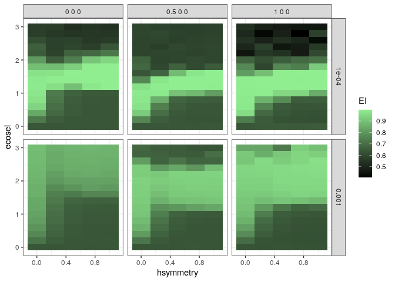
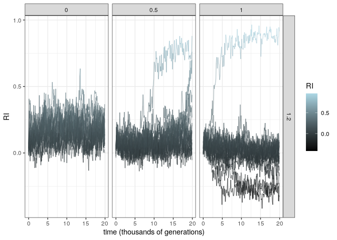
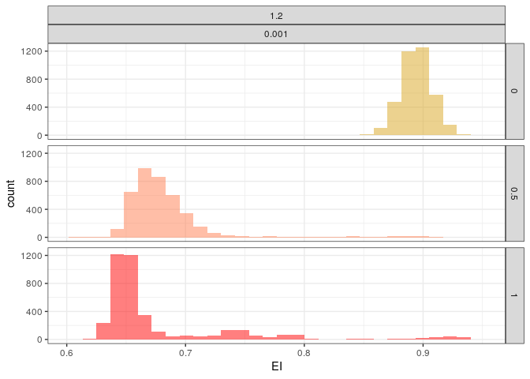

# ggsim: Plotting tools for simulations using ggplot2

Note: all contributions and suggestions to `ggsim` are welcome!

This package provides wrappers around `ggplot2` to make plotting of typical simulation databases easier. Let us first load a simulation dataset. The dataset consists of multiple variables (`EI`, `RI` and `SI`) that were tracked through time across multiple replicate simulations and multiple combinations of parameters (`hsymmetry`, `ecosel`, `dispersal`, `mutation`, `scaleA`, `scaleI`). 


```r
data <- readRDS("data/simulations.rds")
head(data)
#>   hsymmetry ecosel dispersal mutation scaleA scaleI simulation time        EI
#> 1         0      0      0.01    1e-04  1 1 1  0 0 0          1    0 0.6404106
#> 2         0      0      0.01    1e-04  1 1 1  0 0 0          2    0 0.6204491
#> 3         0      0      0.01    1e-04  1 1 1  0 0 0          3    0 0.6490856
#> 4         0      0      0.01    1e-04  1 1 1  0 0 0          4    0 0.6324447
#> 5         0      0      0.01    1e-04  1 1 1  0 0 0          5    0 0.6501745
#> 6         0      0      0.01    1e-04  1 1 1  0 0 0          6    0 0.6145278
#>            RI           SI
#> 1 -0.06380860 -0.024423851
#> 2  0.12492371 -0.032675012
#> 3 -0.13825120 -0.032523132
#> 4  0.02556048  0.032433981
#> 5  0.05684230 -0.004716909
#> 6  0.08863543  0.004762989
```

Let us load the packages we need:


```r
#devtools::install_github("rscherrer/ggsim") # if the package is not already installed
library(tidyverse)
library(ggsim)
library(cowplot) # to assemble multiple plots in the same figure
```

# ggheatmap

We may want an overview of the behavior of our simulations across parameter space. For this, use `ggheatmap`:


```r
ggheatmap(
  data, "EI", x = "hsymmetry", y = "ecosel", reduce = "simulation", 
  how = c(last, mean), keep = c("mutation", "scaleI")
) + 
  scale_fill_gradient(low = "black", high = "lightgreen") +
  facet_grid(mutation ~ scaleI)
```

<!-- -->

Here, we specified the variable to plot, the x- and y-axes, but also how to reduce the data to one variable per tile in the heatmap. By default, the function takes the last value found in the dataset for each tile. If the dataset is already such that there is only one value per tile, there is no need to reduce it. By specifying `reduce = "simulation"` and `how = c(last, mean)`, we first reduce each simulation to its last value of the variable to plot (here, the value at the last time point), and then we average the results over all simulations for each tile. You can supply more elements to `reduce` and `how` for more complex sequential reduction of the data prior to plotting a heatmap. The argument `keep` allows us to count extra variables when grouping by tile, e.g. if we want to subsequently facet by these variables.

# gglineplot

We may also want to plot simulations through time, resulting in many lines on the same plot. Let us first reduce the data to not overcrowd this page:


```r
data <- data %>% filter(
  mutation == 0.001 & scaleI == "1 0 0", ecosel == 1.2, 
  hsymmetry %in% c(0, 0.5, 1)
)
```

We now use `gglineplot`:


```r
data <- data %>% mutate(time = time / 1000)
gglineplot(data, x = "time", y = "RI", line = "simulation") + 
  aes(color = RI) +
  scale_color_gradient(low = "black", high = "lightblue") +
  facet_grid(ecosel ~ hsymmetry) +
  xlab("time (thousands of generations)")
```

<!-- -->

# ggdensityplot

We may want to eyeball distributions across multiple categories, without knowing exactly which kind of visualization we want (density, histogram, boxplot..?). Then, `ggdensityplot` is our friend:


```r
colors <-  c("goldenrod", "coral", "red")
p1 <- ggdensityplot(data, "EI", "hsymmetry", colors = colors)
p2 <- ggdensityplot(data, "EI", "hsymmetry", "density", colors = colors)
p3 <- ggdensityplot(data, "EI", "hsymmetry", "boxplot", colors = colors)
p4 <- ggdensityplot(data, "EI", "hsymmetry", "violin", colors = colors)
plot_grid(p1, p2, p3, p4, ncol = 2, nrow = 2)
```

<!-- -->

This makes it easier for you to explore your data and pick the right visualization that suits your needs, without having to code a lot.

# facettize

We also provide a facetting function that works as a wrapper around `facet_grid` and `facet_wrap`, allowing you to choose between both by specifying an argument (note: append and prepend options do not work properly yet):


```r
p1 %>% facettize(
  facet_cols = c("ecosel", "mutation"), facet_rows = "hsymmetry", 
  facet_wrapped = FALSE
)
```

<!-- -->

The plots returned by these functions are all `ggplot` objects, so they can be further customized as much as you want.

# Note

Please note that this package is not about combining different `ggplot` objects together. Multiple packages exist that do this. Here, we used the `plot_grid` function from `cowplot`, but other are available, including `egg`, `ggpubr` or `grid`. These may be worth looking into for making sure e.g. that plotting frames are correctly aligned across figures (not like in this vignette). Check out a worked out example at https://cran.r-project.org/web/packages/egg/vignettes/Overview.html.